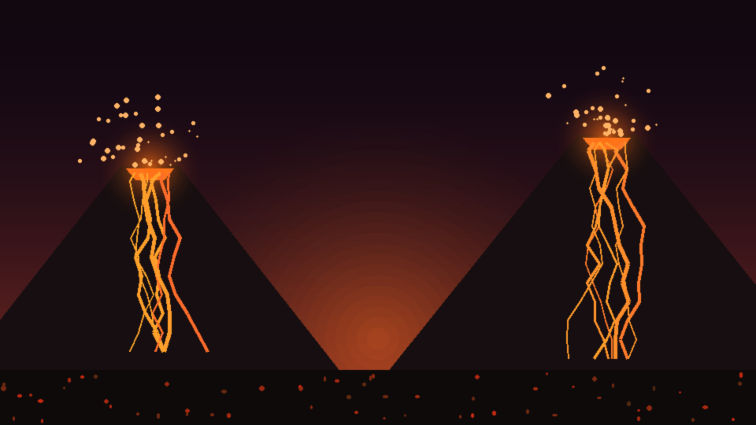

# Линия Битвы — сетевой 1v1 MOBA между двух вулканов (Unity)

Онлайн-игра в духе Mobile Legends, режим **1 на 1**: одна линия, базы, башни,
волны миньонов, **два героя на выбор**, уровни, золото, покупка улучшений — и
**два извергающихся вулкана**, заливающих арену лавой.

Сеть: **Netcode for GameObjects** (хост + клиент, подключение по IP).
Сцена, префабы, иконки и текстуры генерируются кодом — в репозитории нет ни
одного бинарного ассета, сделанного руками.

## Герои

| | Ксардарас (маг) | Белиал (тёмный маг) |
|---|---|---|
| **Q** | Огненный снаряд — быстрый, в сторону курсора | Сгусток тьмы — тяжелее бьёт и замедляет |
| **W** | Телепорт к курсору | Похищение жизни — крадёт HP ближайшего врага |
| **E (ульта, с 4 ур.)** | Метеоритный шторм — большой урон + замедление вокруг | Жатва душ — урон вокруг и лечение за каждого поражённого |
| **Пассивно** | дальше бьёт с руки | **вампиризм 12%** со всего урона, больше HP |

## Вулканы и лава

Каждые ~45–75 секунд вулканы извергаются: экран трясётся, на линию падают
**лужи лавы**. Сначала тёмное пульсирующее пятно (2.5 с — успей отойти), затем
кипящая лава: **60 урона в секунду** героям и миньонам. Через ~10 секунд остывает.

## Требования

- Unity **6000.4.10f1** (Unity 6) — только для редактирования; готовый билд лежит в `Builds/` после сборки.

## Запуск

1. Unity Hub → **Add** → папка проекта → открыть (первый импорт пару минут —
   сцена и префабы создадутся автоматически) → **Play**.
2. Пересоздать всё: меню **MOBA → Rebuild All**; собрать билд: **MOBA → Build macOS Player**.

## Как играть вдвоём

В меню выберите героя, затем один игрок жмёт **«Создать игру (хост)»**, второй
вводит IP хоста и жмёт **«Войти»**. Матч стартует, когда подключились оба.

- **На одном компьютере:** хост в редакторе (или билд), второй экземпляр билда:
  `open -n Builds/MobaGame.app`, IP `127.0.0.1`.
- **По локальной сети / Wi-Fi:** клиент вводит IP хоста (показан в меню и на экране ожидания).
- **Через интернет:** проще всего VPN (Tailscale / Radmin VPN) — вводится VPN-IP
  хоста; либо проброс порта **7777/UDP** на роутере.
- **Флаги для быстрого теста:** `MobaGame.app/Contents/MacOS/MobaGame -host -hero 0`
  и `-join <ip> -hero 1` (0 — Ксардарас, 1 — Белиал).

## Управление

| Клавиша | Действие |
|---|---|
| WASD / стрелки / зажать ПКМ | движение |
| Пробел / ЛКМ | атака ближайшей цели |
| Q / W / E | скиллы героя (E — с 4 уровня) |
| 1 / 2 / 3 | купить улучшение (атака / здоровье / скорость атаки) |
| Колесо мыши | зум камеры; F1 — справка; Esc — меню |

## Механики

- **Миньоны** — волна из 4 каждые 25 секунд, со временем усиливаются.
- **Башня** прикрывает базу (предпочитает миньонов, по героям бьёт больно);
  **база** получает лишь 35% урона, пока её башня стоит.
- **Кусты** скрывают героя от противника; **фонтан** у базы быстро лечит.
- Золото за добивания, башни и убийства; смерть — возрождение с таймером.
- Выход соперника из матча — победа оставшемуся.

## Что где в коде

- `Assets/Scripts/Units/Hero.cs` — герой, оба набора скиллов, статы, прокачка.
- `Assets/Scripts/Units/HeroKind.cs` — данные героев (имена, иконки, описания).
- `Assets/Scripts/Combat/LavaPool.cs` — лужи лавы; `Game/GameManager.cs` — матч, волны, извержения.
- `Assets/Scripts/Game/MapBuilder.cs` — арена, вулканы, атмосфера (строится в рантайме).
- `Assets/Scripts/FX/` — процедурные анимации (ходьба, выпады, парение) и частицы.
- `Assets/Scripts/UI/HudController.cs` — меню с выбором героя и весь HUD (IMGUI).
- `Assets/Scripts/Editor/MobaProjectBuilder.cs` — генерация сцены, префабов и систем частиц.
- Иконки/портреты/текстуры в `Assets/Resources/UI` и `Textures` — сгенерированы скриптом (PIL).

Баланс — константы в начале соответствующих классов: правьте и пробуйте.

---
Сделано с Claude Code: весь проект (код, арт, сцена, префабы) сгенерирован программно.
